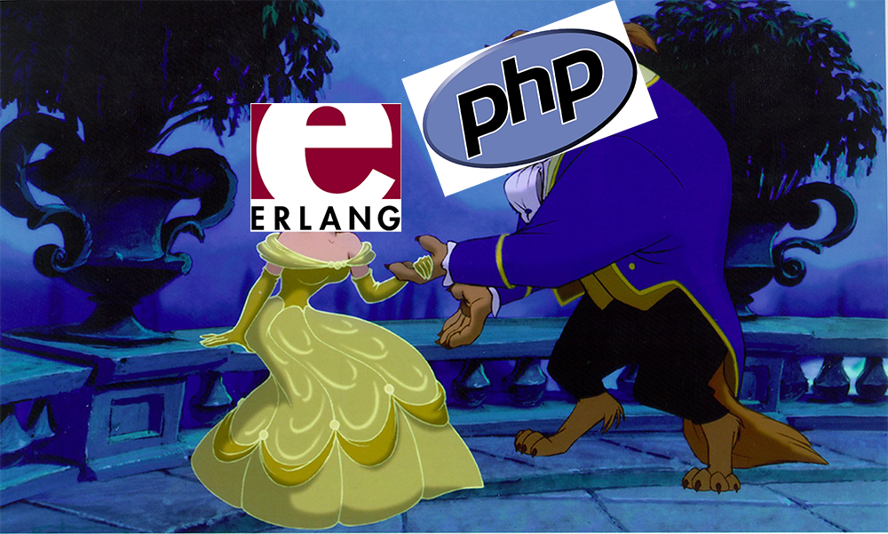

# beauty_and_the_beast



## Building
```
make compile
```

## Running
```
make run_php
make run_erl
```

## cURLing
```
curl -i http://127.0.0.1:1234/beauty
HTTP/1.1 200 OK
Server: Yaws 2.0.4
Date: Mon, 17 Jan 2017 07:17:07 GMT
Content-Length: 13
Content-Type: text/html

hello, beauty
```

```
curl -i http://127.0.0.1:1234/beast.php
HTTP/1.1 200 OK
Server: Yaws 2.0.4
Date: Mon, 17 Jan 2017 07:17:17 GMT
Content-Type: text/html; charset=UTF-8
Transfer-Encoding: chunked
X-Powered-By: PHP/5.6.27

hello, beast
```

## Testing
```
make test
```
